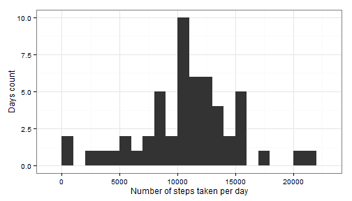
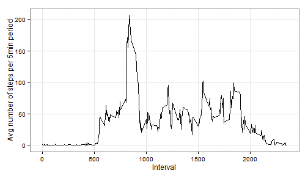

## Loading and preprocessing the data

Let's start by loading the data from `data/activity.csv` and removing NA values


```r
# Load data from CSV
activity <- read.csv("data/activity.csv")
activity <- activity[complete.cases(activity$steps),]
```

## What is mean total number of steps taken per day?

Load libraries, then calculate the sum of all steps taken in a day, before plotting the results in a histogram along with a summary (mean, median).


```r
# Load libraries
library(dplyr)
library(ggplot2)
```


```r
# Add all steps taken in a day together
total_day <- group_by(activity,date)
total_day <- summarize(total_day, total_steps = sum(steps))

# Plot the resulting data
g1 <- ggplot(data = total_day,aes(x=total_steps)) + theme_bw()
g1 <- g1 + geom_histogram(binwidth=1000) 
g1 <- g1 + xlab("Number of steps taken per day") + ylab("Days count")
print(g1)
```

 

```r
# Calculate mean and median and write to report
mean_steps <- mean(total_day$total_steps, na.rm = TRUE)
median_steps <- median(total_day$total_steps, na.rm = TRUE)
```

The mean number of steps per day is 10766.19 and the median is 10765.

## What is the average daily activity pattern?

Calculate the mean number of steps per 5min period and plot it along with all 5min period values as a line graph.


```r
# Calculate mean per 5min period
average_5min <- group_by(activity,interval)
average_5min <- summarize(average_5min, mean_steps = mean(steps))

# Plot new graph
g2 <- ggplot() + theme_bw()
g2 <- g2 + geom_line(data = average_5min,aes(x=interval,y=mean_steps, group = 1))
g2 <- g2 + xlab("Interval") + ylab("Avg number of steps per 5min period")
print(g2)
```

 

The mean number of steps per 5min period is 1.

## Imputing missing values


## Are there differences in activity patterns between weekdays and weekends?
