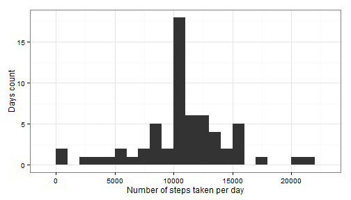
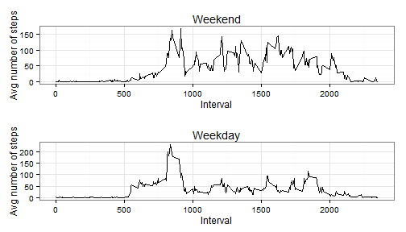

## Loading and preprocessing the data

Let's start by loading the data from `data/activity.csv` and removing NA values


```r
# Load data from CSV
activity_with_na <- read.csv("data/activity.csv")
activity <- activity_with_na[complete.cases(activity_with_na$steps),]
```

## What is mean total number of steps taken per day?

Load libraries, then calculate the sum of all steps taken in a day, before plotting the results in a histogram along with a summary (mean, median).


```r
# Load libraries
library(dplyr)
library(ggplot2)
```


```r
# Add all steps taken in a day together
total_day <- group_by(activity,date)
total_day <- summarize(total_day, total_steps = sum(steps))

# Plot the resulting data
g1 <- ggplot(data = total_day,aes(x=total_steps)) + theme_bw()
g1 <- g1 + geom_histogram(binwidth=1000) 
g1 <- g1 + xlab("Number of steps taken per day") + ylab("Days count")
print(g1)
```

 

```r
# Calculate mean and median and write to report
mean_steps <- mean(total_day$total_steps, na.rm = TRUE)
median_steps <- median(total_day$total_steps, na.rm = TRUE)
```

The mean number of steps per day is **10766.19** and the median is **10765**.

## What is the average daily activity pattern?

Calculate the mean number of steps per 5min period and plot it along with all 5min period values as a line graph.


```r
# Calculate mean per 5min period
average_5min <- group_by(activity,interval)
average_5min <- summarize(average_5min, mean_steps = mean(steps))

# Plot new graph
g2 <- ggplot() + theme_bw()
g2 <- g2 + geom_line(data = average_5min,aes(x=interval,y=mean_steps, group = 1))
g2 <- g2 + xlab("Interval") + ylab("Avg number of steps per 5min period")
print(g2)
```

 

```r
# Find maximum
max_5min <- average_5min[match(max(average_5min$mean_steps),average_5min$mean_steps),]
```

The interval with the maximum number of steps per 5min period is **835**, at **206.17** steps.

## Imputing missing values

Calculate number of missing values, then fill in using a simple strategy (we'll reuse the average for each interval, calculated previously).


```r
# Count number of NAs
na_count = sum(is.na(activity_with_na))
```

There are **2304** NA values. We'll now impute the missing NA values.


```r
activity_imputed <- merge(activity_with_na,average_5min,by = "interval")
na_idx <- is.na(activity_imputed$steps)
activity_imputed$steps[na_idx] <- activity_imputed$mean_steps[na_idx]
activity_imputed <- select(activity_imputed, steps,date,interval)
```

We'll check the effect of imputing data by recreating the previous histogram with the new imputed data, and comparing the results (median and mean).


```r
# Add all steps taken in a day together
total_day <- group_by(activity_imputed,date)
total_day <- summarize(total_day, total_steps = sum(steps))

# Plot the resulting data
g3 <- ggplot(data = total_day,aes(x=total_steps)) + theme_bw()
g3 <- g3 + geom_histogram(binwidth=1000) 
g3 <- g3 + xlab("Number of steps taken per day") + ylab("Days count")
print(g3)
```

 

```r
# Calculate mean and median and write to report
mean_steps <- mean(total_day$total_steps, na.rm = TRUE)
median_steps <- median(total_day$total_steps, na.rm = TRUE)
```

The mean number of steps per day for the imputed data is **10766.19** and the median is **10766.19**. There is little impact on the mean/median values, but of course we can see the impact of NA value replacement on the height of the histogram near the average.

## Are there differences in activity patterns between weekdays and weekends?

For this part, we will split the original dataset (with new imputed values) between weekend and weekday to understand if there's a difference in activity patterns throughout the day.


```r
library(gridExtra)
```

```
## Loading required package: grid
```

```r
# Split weekend from weekday
activity_imputed$DayOfWeek <- weekdays(as.Date(activity_imputed$date))
activity_imputed$Weekend <- ifelse(activity_imputed$DayOfWeek %in% c("Saturday", "Sunday"),"Weekend","Weekday") # vectorized operations yay!
activity_imputed$Weekend <- as.factor(activity_imputed$Weekend)

# Calculate mean per 5min period for weekends and weekdays
average_weekend <- group_by(activity_imputed[activity_imputed$Weekend == "Weekend",],interval)
average_weekend <- summarize(average_weekend, mean_steps = mean(steps))
average_weekday <- group_by(activity_imputed[activity_imputed$Weekend == "Weekday",],interval)
average_weekday <- summarize(average_weekday, mean_steps = mean(steps))

# Create weekend and weekday plots, then multiplot
g4 <- ggplot() + theme_bw()
g4 <- g4 + geom_line(data = average_weekend,aes(x=interval,y=mean_steps, group = 1))
g4 <- g4 + xlab("Interval") + ylab("Avg number of steps") + ggtitle("Weekend")
g5 <- ggplot() + theme_bw()
g5 <- g5 + geom_line(data = average_weekday,aes(x=interval,y=mean_steps, group = 1))
g5 <- g5 + xlab("Interval") + ylab("Avg number of steps") + ggtitle("Weekday")
grid.arrange(g4, g5, nrow=2)
```

 

There is a different pattern between weekends and weekdays. On weekdays there is a common phase of high number of steps in the morning, while it is more spread out/erratic during the weekend.
